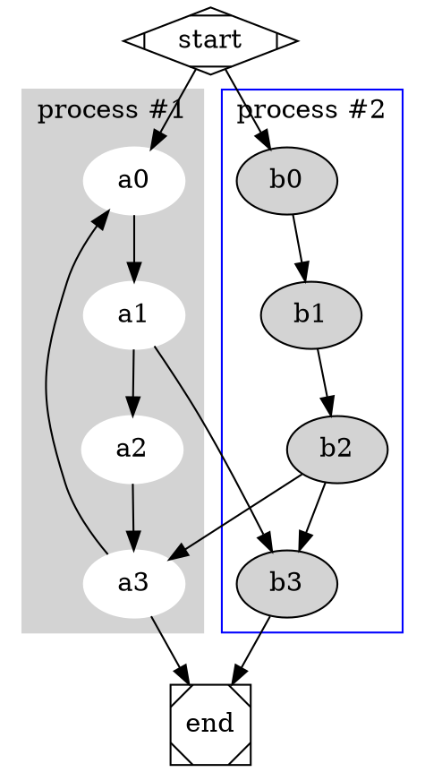

Draw flow chart with dot and graphviz 

## Install 

直接在系统中安装`Graphviz`
```bash
$ sudo install Graphviz
```
作为 python package 安装
```bash
$ sudo python -m pip install graphviz
```

## Usage

```bash
$ dot -Tpng dotfile.dot -odotfile.png
-Tv         - Set output format to 'v'
-Kv         - Set layout engine to 'v' (overrides default based on command name)
-ofile      - Write output to 'file'
```

## Examples

- E1

```graphviz
$ vi dotfile.dot
	digraph G {
	    one -> two;
	    one -> three;
	    one -> four;
	    four -> five -> six;
	    five -> one;
	    six -> two;
	}
# 几种不同的 Graphviz 命令,一般用 dot
$ dot -Tpng dotfile.dot -o dotDot.png
# circo -Tpng dotfile.dot -o dotCirco.png
# fdp -Tpng dotfile.dot -o dotFdp.png
# sfdp -Tpng dotfile.dot -o dotSfdp.png
# neato -Tpng dotfile.dot -o dotNeato.png
```

<div align="center"></div>

- E2


<div align="center"></div>
	

## Links

- [使用 Dot 语言和 Graphviz 绘图](https://casatwy.com/shi-yong-dotyu-yan-he-graphvizhui-tu-fan-yi.html)


    


