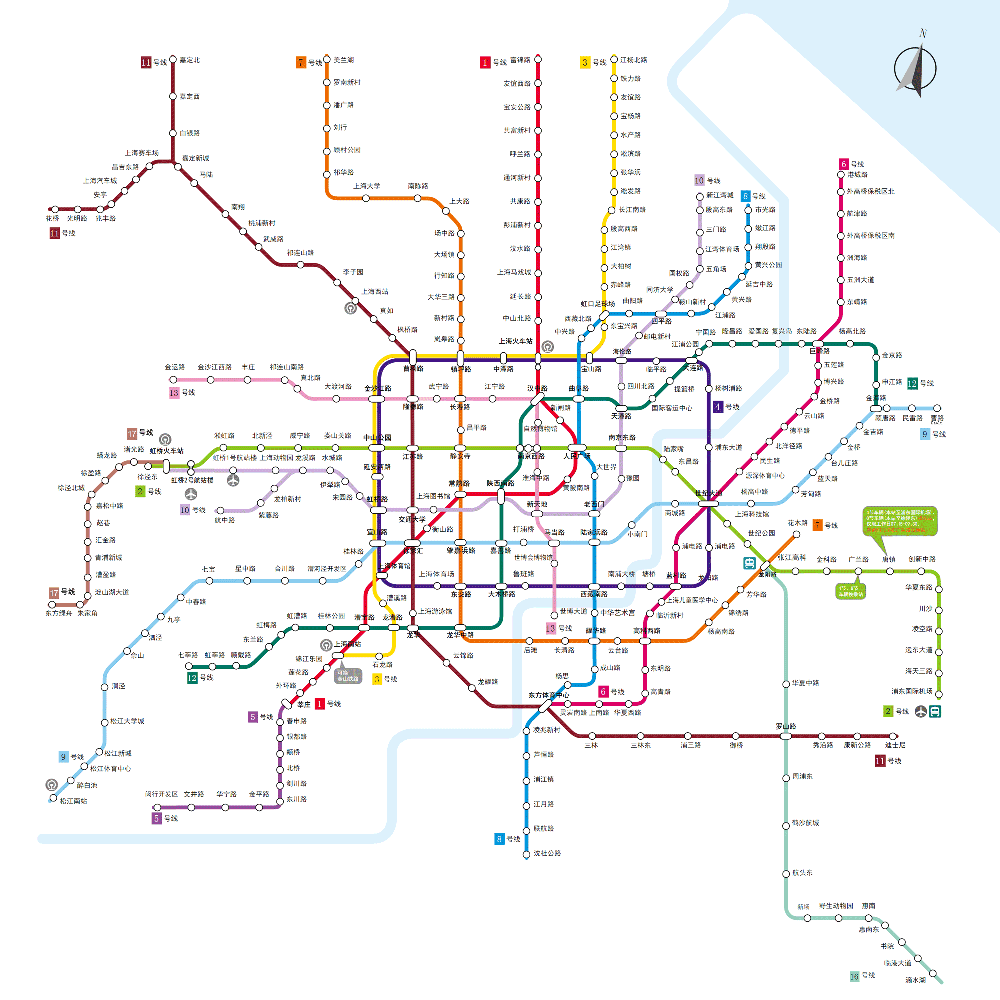

Updating......

# 买房

## 房屋参数

- 容积率：建筑面积/用地面积，给定的土地上，盖了多少面积的房子。
- 绿化率：建设用地范围内的绿化面积与规划建设用地面积之比
- 绿化覆盖率：路滑垂直投影面积与占地面积的百分比（树的影子也算入绿化率）
- 得房率：套内建筑面积与套（单元)建筑面积之比。
  - 套内建筑面积包括
  	- 套内使用面积
  	- 套内墙体面积
  	- 阳台建筑面积
  - 套建筑面积包括
    - 套内建筑面积
	- 分摊的公用建筑面积
- 车位配比：小区总户数与车位总数的比，通常表示为`1:X`, 其中`1`指小区住户总量，`X`指小区车位数量
- 公摊面积
  

## 买房基本概念

- 满 X 唯 Y: 房屋产权届满 X 年，这套房子是以家庭为单位的唯 Y 住宅
- X 室 Y 厅：卧室数量为 X，一厅为客厅，两厅一般为客厅+餐厅

## 买房成本

- 契税
  - 上海市卖房通常是到手价，即卖家需要缴纳的增值税和个税也是由买家来缴
- 中介费
  - 二手房中介费可和中介商量
  - 新盘不需要中介费
- 房价: 微信公众号上海本地宝，发送 小区名+房价, 如都市富苑房价， 查看小区最新成交价

## List

- 都市富苑--闵行区都市路778号
  - 容积率：1.21
  - 绿化率：40%
  - 总户数：762
  - 建筑面积：85500
  - 占地面积：65000
  - 开盘时间：2010
- 万科清林径
  - 容积率：1.5
  - 绿化率：45%
  - 总户数：1269户

## Todo

- [ ] 满五唯一--[省多少钱](https://zhuanlan.zhihu.com/p/22148001)

# 上海基本知识

## 交通出行

### 地铁

- 上海地铁[现有线路图](http://sh.bendibao.com/ditie/linemap.shtml)

- 2020上海地铁[线路图](http://sh.bendibao.com/ditie/linemap.shtml)(现有+规划)

- 上海地铁线路[规划](http://sh.bendibao.com/ditie/plan.shtml)
	- 2018-2023上海市轨道交通第三期建设规划方案项目

## 行政区划

{:.center_w800}

## 浦东新区

### 新场

>>感兴趣新闻

- [一所亚洲一流的中医特色康复医院将在新场建成](http://www.pudong.gov.cn/shpd/childSite/20191016/016027005_8d713dcf-6bea-4f79-98e3-7f1a8a95e327.htm)

# 参考内容

- [上海本地宝](http://sh.bendibao.com/)
- [github杭州买房经验](https://github.com/houshanren/hangzhou_house_knowledge)
- [上海限购政策](https://zhuanlan.zhihu.com/p/34229530)
- [容积率真的越低越好吗](https://page.lianjia.com/subject/28768.html)
- [浦东网上信访受理(投诉)中心](http://qxf.sh.gov.cn/310115)
- [浦东教育--官网](http://www.pudong.gov.cn/jyj/)
