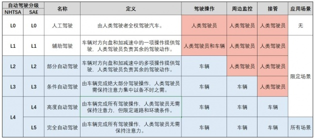

 

# 汽车基本知识

## 汽车分级

六个等级

- A00: 
- A0
- A
- B
- C
- D

现阶段，A级车的主流轴距已经来到了2700mm上下 (如丰田雷凌--[Toyota Levin](https://www.gac-toyota.com.cn/vehicles/2019newlevin), 轴距2700mm)。
B级车到了2900mm (如丰田2019凯美瑞双擎--[Toyota Camry Hev](https://www.gac-toyota.com.cn/vehicles/camryhev)， 轴距2825mm)。

## 汽车自动化分级
《汽车驾驶自动化分级》(已通过全国汽车标准化技术委员会评审, 将于2020年发布): 该标准将自动化驾驶分为5级，其中 L5 为完全自动驾驶，任何情况下都不需要人工接管。如下图所示（[图片来源](https://k.sina.com.cn/article_6087550565_16ad8a66500100mer6.html)）

## 庖丁解牛--车辆配件知识
## 车轮
### 轮毂
#### 轮毂材质(铝合金和钢)
  - 铝合金轮毂
    - 优势
	  - 可塑性强
	  - 质轻，由此可以提升加速性能/刹车性能/操控性能/舒适性，且悬挂负担小(簧下一公斤，簧上十公斤)等优势
	  - 油耗下降
	  - 散热性能好
	  - 视觉效果好
	- 劣势
	  - 价格贵
	  - 变形后无法继续使用，只能更换
  - 刚轮毂
    - 价格低
	- 韧性好，不易坏，省心

#### 轮毂尺寸
- 轮毂尺寸: 指轮毂直径，如15/16/19寸。
- 轮毂尺寸: 针对具体一款车，轮毂尺寸大，则轮胎扁平比高，大尺寸轮毂的优缺点
  - **视觉效果好**
  - 可增加车辆稳定型
  - 能放入更大的刹车系统
  - 舒适性下降(轮毂尺寸大导致轮胎扁平比较高，而轮胎厚度越低，减震性能越差)
  - 性能下降(轮胎密度大于轮毂，因此相同质量的车轮，轮毂越大，车轮转动惯量越大，影响加/减速)
  - 油耗会增加（为何？）
- 轮毂宽度：又称J值
- PCD： 节圆直径，指轮毂中央的固定螺栓见的直径。如4X103, 4X114.3, 5X112，X前值螺旋数量，X后指螺栓形成的圆的直径, 为了安全和稳定性，一般选择PCD和原车一直的轮毂进行升级改造
- 偏距：Offset, 俗称ET值，轮毂螺栓固定面与几何中心线（轮毂横剖面中心线)间距离，决定轮毂安装后时向内缩进还是向外凸出。

## 车辆信息

| 车辆型号|轴距(mm)|三围(长宽高mm)|价格(万)|其他|
|:--: |:--: |:--: |:--: |:--: |
|比亚迪[秦Plus dmi](http://mall.bydauto.com.cn/pc/activityDetail/?id=D015QG21EG99)|2718|4765\*1837*1495|10.78+|轮距1580/1590mm|
|比亚迪[秦Plus ev](https://www.bydauto.com.cn/auto/carShow.html-param=%E7%A7%A6PLUSEV)|2718|4765\*1837*1515|12.98+|轮距1580mm|
|丰田[雷凌双擎E+](https://www.gac-toyota.com.cn/minisite/Campaigns/2019/levinphevTable?module=18jy)|2700|4645\*1775\*1480|20.38+|轮距1525/1520mm|
|日产[轩逸](https://www.dongfeng-nissan.com.cn/car-configuration-preferences-page?carSeriesId=507cf5b433174992ac49d1827b625b85&CarTypeId=242148)|2712|4641\*1815\*1450|11.90+|轮距1588/1594mm|
|奥迪[A3](https://www.audi.cn/cn/web/zh/models/a3/a3_sportback.html#layer=/cn/web/zh/models/a3/a3_sportback/layer/six-icon-1.html)|2630|4343\*1815\*1458|20.31+|轮距1543/1514mm|
|奥迪[A3L](https://contact.audi.cn/contact/performanceequipment_getequipment.htm?carStyleId=164187)|2680|4548\*1814\*1429|20.96+|轮距1543/1514mm|
|吉利[星瑞](https://preface.geely.com/preface)|2800|4785\*1869\*1469|11.37+|轮距1618mm|
|比亚迪[汉EV](http://www.bydauto.com.cn/auto/carShow.html-param=%E6%B1%89EV)|2920|4980\*1910\*1495|22.98+|轮距1640mm|
|Tesla [Model 3](https://www.tesla.cn/model3)|2880|4694\*1849\*1443|24.99+||
|Tesla [Model Y](https://www.tesla.cn/modely)|2890|4750\*1921\*1624|27.6+||
|丰田[亚洲龙混动](https://www.ftms.com.cn/buycar/cartype/detail/avalon)|2870|4975\*1850\*1450|23+|
|本田[十代雅阁混动](https://www.ghac.cn/vehicles/honda/accord-sporthybrid/p#page9)|2830|4893\*1862\*1449|20+|
|丰田[凯美瑞混动](https://www.gac-toyota.com.cn/vehicles/camryhev)|2825|4885\*1840\*1455|24+|轮距1575/1585mm|
|比亚迪[宋pro 2gen](https://www.bydauto.com.cn/auto/carShow.html-param=%E7%AC%AC%E4%BA%8C%E4%BB%A3%E5%AE%8BPro)|2712|4650\*1860\*1700|9.28+|轮距1565mm|
|比亚迪[宋Plus dmi](http://mall.bydauto.com.cn/pc/activityDetail/?id=D017QG21EG99)|2765|4705\*1890\*1680|14.68+|轮距1630mm|
|比亚迪[唐 dmi](https://www.bydauto.com.cn/auto/carShow.html-param=%E5%94%90DM-i) |2820|4870\*1950\*1725|18.98+|轮距1650/1630mm|
|奥迪[Q3](https://contact.audi.cn/contact/performanceequipment_getequipment.htm?carStyleId=164141)|2680|4518\*1843\*1573|28.73+|轮距1578/1570mm|
|奥迪[Q5](https://contact.audi.cn/contact/performanceequipment_getequipment.htm?carStyleId=164162)|2908|4778\*1892\*1666|42.68+|轮距1616/1609mm|

# Ref 
- [上海绿牌政策--20191126](http://wenda.bendibao.com/life/20191126/98893.shtm)
- [国拍行](https://www.alltobid.com/)

